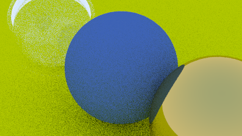

# Parallel Ray Tracer with MPI

This is a CPU ray tracer based on the "Ray Tracing in One Weekend" book, which I extended with MPI functionality to utilize multiple nodes for rendering processes. Shown below is the cover of "Ray Tracing in One Weekend" rendered using my ray tracer.

## Table of Contents

- [Introduction](#introduction)
- [Features](#features)
- [Results](#results)

## Introduction

This ray tracer project was based on the "Ray Tracing in One Weekend" book series by Peter Shirley. It implements the fundamentals of ray tracing and includes features like spheres, Lambertian reflection, and metal materials. One thing that I wanted to add to this project was the addition of MPI (Message Passing Interface) functionality, enabling parallel rendering on a cluster or multi-core machine. In my case, I ran MPI with 4 nodes on an i7-7500U with four threads. 

## Features

- Basic ray tracing features (spheres, rays, materials).
- Lambertian, metal, and dielectric (Glass) material rendering.
- Multi-threaded rendering using MPI (~36% maximum speed up!)
- Abstract classes for shapes. material, and hittable objects.

## Results

Below are some screenshots of the progression of my ray tracer. 

The sphere above is colored based on the direction of the normal vectors, where the x-component is red, y-component is green, and the z-component is blue.

I implemented anti-aliasing in my ray tracer by sending multiple samples for each pixel in a unit square around the desired pixel. 

Diffusion was implemented using a Lambertian distribution, where the ray's reflection direction was chosen using a randomly selected vector in the unit circle tangent to the object. 

I implemented metal by having the rays directly fully reflect off the surface, multiplied by an albedo that comes from the color of our material. The metals can be made fuzzy by adding a randomly generated unit direction vector to the reflected vector. The left sphere is a fuzzy metal, while the right is a fully reflective metal. 

Glass was implemented using refraction and Snell's Law (Which I'm still a little confused about).

Interval reflection was applied to the glass ball on the left by checking if there were any solutions to Snell's Law, and reflecting the ray if no solutions were found. 

Camera positioning was implemented by assigning a camera location point and a "look at" point, then using the ray from between the two points and an arbitrary "Up vector" to define a right-handed coordinate system. 

The last feature from the tutorial was blurring with distance. This was implemented by simulating a lens on the camera, and generating rays from a randomly selected location on the lens instead of the true center. 

Finally, I was able to the generate the image of the cover. 

The same image generated with MPI: 

